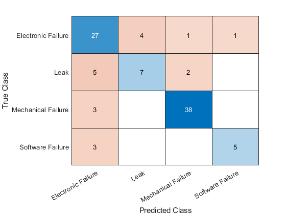
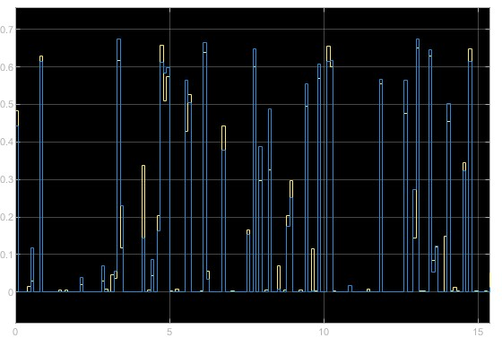
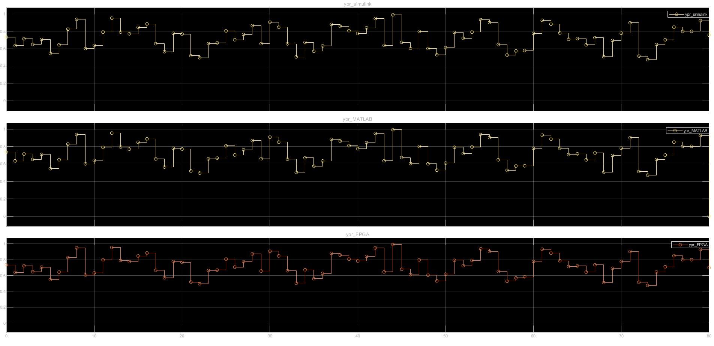

# **FPGA and GPU Implementation of ML and DL Algorithms**

This repository contains a comparative study and implementation of Machine Learning (ML) and Deep Learning (DL) algorithms on **Field Programmable Gate Arrays (FPGA)** and **Graphics Processing Units (GPU)**. The goal of the study is to analyze and compare the performance of FPGA and GPU platforms in terms of **processing speed**, **power efficiency**, and **accuracy**.

The FPGA implementation is carried out using **MATLAB HDL Coder**, and the models are deployed on the **Nexys A7 FPGA board**. For the GPU implementation, the study leverages an **Nvidia GeForce RTX 3060**.

## **Table of Contents**
- [Introduction](#introduction)
- [Hardware and Tools](#hardware-and-tools)
- [Project Workflow](#project-workflow)
- [Key Features](#key-features)
- [Performance Metrics](#performance-metrics)
- [Requirements](#requirements)
- [Installation](#installation)
- [Usage](#usage)
- [Results](#results)
- [Contributing](#contributing)
- [License](#license)

## **Introduction**

The increasing demand for high-performance machine learning (ML) and deep learning (DL) models has led to a focus on optimizing both **hardware** and **software**. This project explores the trade-offs between **FPGAs** and **GPUs** when running computational models, with an emphasis on:

- **Speed**: Time taken for model inference and training.
- **Power Efficiency**: Energy consumption during processing.
- **Accuracy**: Performance of the models deployed on both platforms.

By deploying the same ML/DL models on both FPGA and GPU, we can evaluate which platform is more suited for specific use cases, especially where low power and efficiency are critical.

## **Hardware and Tools**

### **Hardware**
- **Nexys A7 FPGA board**:
  - Operating Frequency: 60-90 MHz
  - Used for running the ML and DL algorithms generated from HDL code.
  
- **Nvidia GeForce RTX 3060 GPU**:
  - VRAM: 6 GB
  - Used for running the same ML and DL models optimized for GPU architecture.
  
- **Intel Core i7-12700H CPU**
- **32 GB RAM**

### **Software Tools**
- **MATLAB**:
  - Used for designing and implementing ML/DL models.
  - **HDL Coder** for generating VHDL/Verilog code from MATLAB models.
  
- **Vivado**:
  - For FPGA bitstream generation and programming.
  
- **Python and CUDA**:
  - Used for GPU implementation of the models using frameworks like PyTorch or TensorFlow.
  
## **Project Workflow**

1. **Model Development**:
   - Create ML/DL models in MATLAB.
   - Pre-train the models using MATLAB or Python (for GPU).
   
2. **HDL Code Generation**:
   - Use **MATLAB HDL Coder** to generate HDL code from the models for FPGA implementation.

3. **Deployment on FPGA**:
   - Program the **Nexys A7 FPGA board** using **Vivado** with the generated HDL code.
   - Measure the processing speed and power efficiency on the FPGA.
   
4. **Deployment on GPU**:
   - Deploy the pre-trained models on **Nvidia RTX 3060**.
   - Measure the speed and energy consumption on the GPU.

5. **Comparison**:
   - Evaluate the performance metrics such as speed, power consumption, and accuracy for both platforms.

## **Key Features**

- **Multi-platform comparison**:
  - Compare the **speed**, **accuracy**, and **power consumption** of the models running on FPGA and GPU platforms.
  
- **Scalability**:
  - Easily scalable to more complex models and hardware configurations.
  
- **HDL Coder**:
  - The study demonstrates how to use **HDL Coder** to convert MATLAB models into hardware-compatible VHDL/Verilog for FPGA deployment.

- **Power efficiency focus**:
  - Detailed analysis of energy consumption, making the project valuable for energy-constrained applications.

## **Performance Metrics**

The performance is evaluated based on three primary metrics:

1. **Processing Speed**:
   - Time taken to complete inference or training on both FPGA and GPU platforms.
  
2. **Power Efficiency**:
   - Energy consumption during model execution. Lower power consumption is highly desirable in edge computing environments.

3. **Accuracy**:
   - Performance of ML/DL models in terms of prediction accuracy after being deployed on each platform.

## **Requirements**

To replicate the study, you will need:

### **Hardware**
- Nexys A7 FPGA board
- Nvidia GPU (e.g., RTX 3060)
- Intel-based CPU or equivalent

### **Software**
- MATLAB with HDL Coder
- Xilinx Vivado (for FPGA programming)
- Python with TensorFlow/PyTorch (for GPU)
- CUDA Toolkit (for GPU)

## **Installation**

1. **Clone the repository**:
    ```bash
    git clone https://github.com/Monish-KS/FPGA_GPU_ML_Comparison.git
    cd FPGA_GPU_ML_Comparison
    ```

2. **MATLAB Setup**:
   - Ensure that MATLAB with **HDL Coder** is installed.
   - Install necessary toolboxes for generating HDL code.

3. **Vivado Setup**:
   - Install **Xilinx Vivado** for FPGA programming.

4. **Python and GPU Setup**:
   - Set up the **Python** environment and install required libraries:
     ```bash
     pip install torch tensorflow numpy
     ```
   - Install **CUDA Toolkit** for GPU acceleration.

## **Usage**

### **Running the Models on FPGA**

1. Load the ML/DL models in MATLAB.
2. Use **HDL Coder** to generate HDL code.
3. Program the **Nexys A7 FPGA** using **Vivado** with the generated bitstream.
4. Measure performance metrics using onboard monitoring tools or external measurement tools.

### **Running the Models on GPU**

1. Run the models in Python (PyTorch or TensorFlow) using the **RTX 3060** GPU.
2. Measure speed and power usage using GPU monitoring tools - **nvidia-smi** and **Vivado**.

### **Performance Comparison**

Once the models have been run on both FPGA and GPU, compare the results in terms of:

- Speed (latency, throughput)
- Power consumption
- Accuracy of predictions

## **Results**

This section should be updated with actual results from your experiments. A typical result would include a table comparing the **speed**, **power consumption**, and **accuracy** between the FPGA and GPU platforms. Here's a sample format:

| Model                    | Accuracy in FPGA (%) | Accuracy in GPU (%) |
|---------------------------|----------------------|---------------------|
| Regression Model          | 97.40                | 92.21               |
| Image Classification Model| 85.42                | 82.29               |
| BERT Model                | 96.45                | 97.47               |


Accuracy On Training: 


Confusion Matrix:


FPGA Results: 



## **Contributing**

Contributions are welcome! Feel free to submit issues, feature requests, or pull requests.

1. Fork the repository
2. Create a new branch (`git checkout -b feature/your-feature`)
3. Commit your changes (`git commit -m 'Add some feature'`)
4. Push to the branch (`git push origin feature/your-feature`)
5. Open a pull request

## **License**

This project is licensed under the MIT License. See the [LICENSE](LICENSE) file for details.

